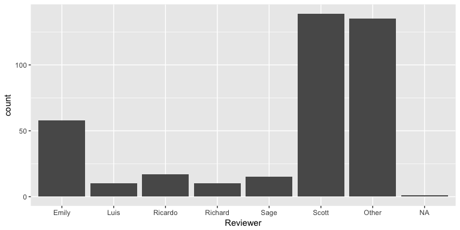
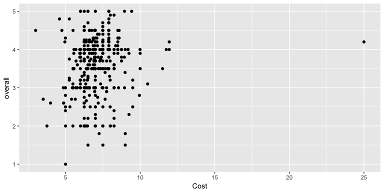

02A - Analysis
================
Mine Cetinkaya-Rundel
1/23/2018

``` r
knitr::opts_chunk$set(echo=FALSE)
```

Load packages
-------------

The data
--------

The data come from [Kaggle.com](https://www.kaggle.com/srcole/burritos-in-san-diego),

    ## Warning: Duplicated column names deduplicated: 'Salsa' => 'Salsa_1' [50]

Mexican cuisine is often the best food option is southern California. And the burrito is the hallmark of delicious taco shop food: tasty, cheap, and filling. Appropriately, an effort was launched to critique burritos across the county and make this data open to the lay burrito consumer. At this time, the data set contains ratings from over 385 burritos fromd 102 restaurants.

There are 10 core dimensions of the San Diego burrito. \* Volume \* Tortilla quality *Temperature * Meat quality \* Non-meat filling quality \* Meat-to-filling ratio \* Uniformity \* Salsa quality \* Flavor synergy \* Wrap integrity

All of these measures (except for Volume) are rated on a scale from 0 to 5, 0 being terrible, and 5 being optimal. Other information available for each burrito includes an overall rating, cost, Yelp rating of the restaurant, and more.

    ## Observations: 385
    ## Variables: 66
    ## $ Location         <chr> "Donato's taco shop", "Oscar's Mexican food",...
    ## $ Burrito          <chr> "California", "California", "Carnitas", "Carn...
    ## $ Date             <chr> "1/18/2016", "1/24/2016", "1/24/2016", "1/24/...
    ## $ Neighborhood     <chr> "Miramar", "San Marcos", NA, NA, "Carlsbad", ...
    ## $ Address          <chr> "6780 Miramar Rd", "225 S Rancho Santa Fe Rd"...
    ## $ URL              <chr> "http://donatostacoshop.net/", "http://www.ye...
    ## $ Yelp             <dbl> 3.5, 3.5, NA, NA, 4.0, NA, 3.0, NA, 3.0, 4.0,...
    ## $ Google           <dbl> 4.2, 3.3, NA, NA, 3.8, NA, 2.9, NA, 3.7, 4.1,...
    ## $ Chips            <chr> NA, NA, NA, NA, "x", NA, NA, NA, "x", NA, NA,...
    ## $ Cost             <dbl> 6.49, 5.45, 4.85, 5.25, 6.59, 6.99, 7.19, 6.9...
    ## $ Hunger           <dbl> 3.0, 3.5, 1.5, 2.0, 4.0, 4.0, 1.5, 4.0, 3.5, ...
    ## $ `Mass (g)`       <int> NA, NA, NA, NA, NA, NA, NA, NA, NA, NA, NA, N...
    ## $ `Density (g/mL)` <dbl> NA, NA, NA, NA, NA, NA, NA, NA, NA, NA, NA, N...
    ## $ Length           <dbl> NA, NA, NA, NA, NA, NA, NA, NA, NA, NA, NA, N...
    ## $ Circum           <dbl> NA, NA, NA, NA, NA, NA, NA, NA, NA, NA, NA, N...
    ## $ Volume           <dbl> NA, NA, NA, NA, NA, NA, NA, NA, NA, NA, NA, N...
    ## $ Tortilla         <dbl> 3.0, 2.0, 3.0, 3.0, 4.0, 3.0, 2.0, 2.5, 2.0, ...
    ## $ Temp             <dbl> 5.0, 3.5, 2.0, 2.0, 5.0, 4.0, 3.0, 3.0, 4.5, ...
    ## $ Meat             <dbl> 3.00, 2.50, 2.50, 3.50, 4.00, 5.00, 3.00, 3.0...
    ## $ Fillings         <dbl> 3.5, 2.5, 3.0, 3.0, 3.5, 3.5, 2.0, 2.5, 3.5, ...
    ## $ `Meat:filling`   <dbl> 4.0, 2.0, 4.5, 4.0, 4.5, 2.5, 2.5, 3.0, 1.5, ...
    ## $ Uniformity       <dbl> 4.0, 4.0, 4.0, 5.0, 5.0, 2.5, 2.5, 3.5, 3.0, ...
    ## $ Salsa            <dbl> 4.0, 3.5, 3.0, 4.0, 2.5, 2.5, NA, NA, 3.5, 1....
    ## $ Synergy          <dbl> 4.0, 2.5, 3.0, 4.0, 4.5, 4.0, 2.0, 2.5, 4.0, ...
    ## $ Wrap             <dbl> 4.0, 5.0, 5.0, 5.0, 4.0, 1.0, 3.0, 3.0, 2.0, ...
    ## $ overall          <dbl> 3.80, 3.00, 3.00, 3.75, 4.20, 3.20, 2.60, 3.0...
    ## $ Rec              <chr> NA, NA, NA, NA, NA, NA, NA, NA, NA, NA, NA, N...
    ## $ Reviewer         <chr> "Scott", "Scott", "Emily", "Ricardo", "Scott"...
    ## $ Notes            <chr> "good fries: 4/5", "Fries: 3/5; too little me...
    ## $ Unreliable       <chr> NA, NA, NA, NA, NA, NA, NA, NA, NA, NA, NA, N...
    ## $ NonSD            <chr> NA, NA, NA, NA, NA, NA, NA, NA, NA, NA, NA, N...
    ## $ Beef             <chr> "x", "x", NA, "x", "x", NA, "x", NA, "x", "x"...
    ## $ Pico             <chr> "x", "x", "x", "x", "x", NA, NA, "x", "x", "x...
    ## $ Guac             <chr> "x", "x", "x", "x", NA, "x", NA, "x", "x", "x...
    ## $ Cheese           <chr> "x", "x", NA, NA, "x", "x", "x", NA, "x", NA,...
    ## $ Fries            <chr> "x", "x", NA, NA, "x", NA, "x", NA, "x", NA, ...
    ## $ `Sour cream`     <chr> NA, NA, NA, NA, NA, "x", "x", NA, "x", NA, NA...
    ## $ Pork             <chr> NA, NA, "x", NA, NA, NA, NA, "x", NA, NA, NA,...
    ## $ Chicken          <chr> NA, NA, NA, NA, NA, "x", NA, NA, NA, NA, NA, ...
    ## $ Shrimp           <chr> NA, NA, NA, NA, NA, NA, NA, NA, NA, NA, "x", ...
    ## $ Fish             <chr> NA, NA, NA, NA, NA, NA, NA, NA, NA, NA, NA, N...
    ## $ Rice             <chr> NA, NA, NA, NA, NA, "x", NA, NA, NA, NA, "x",...
    ## $ Beans            <chr> NA, NA, NA, NA, NA, "x", NA, NA, NA, NA, NA, ...
    ## $ Lettuce          <chr> NA, NA, NA, NA, NA, "x", NA, NA, NA, NA, NA, ...
    ## $ Tomato           <chr> NA, NA, NA, NA, NA, "x", NA, NA, NA, NA, NA, ...
    ## $ `Bell peper`     <chr> NA, NA, NA, NA, NA, NA, NA, NA, NA, NA, "x", ...
    ## $ Carrots          <chr> NA, NA, NA, NA, NA, NA, NA, NA, NA, NA, NA, "...
    ## $ Cabbage          <chr> NA, NA, NA, NA, NA, NA, NA, NA, NA, NA, NA, N...
    ## $ Sauce            <chr> NA, NA, NA, NA, NA, NA, NA, NA, NA, NA, NA, N...
    ## $ Salsa_1          <chr> NA, NA, NA, NA, NA, NA, NA, NA, NA, NA, NA, N...
    ## $ Cilantro         <chr> NA, NA, NA, NA, NA, NA, NA, NA, NA, NA, NA, N...
    ## $ Onion            <chr> NA, NA, NA, NA, NA, NA, NA, NA, NA, NA, NA, N...
    ## $ Taquito          <chr> NA, NA, NA, NA, NA, NA, NA, NA, NA, NA, NA, N...
    ## $ Pineapple        <chr> NA, NA, NA, NA, NA, NA, NA, NA, NA, NA, NA, N...
    ## $ Ham              <chr> NA, NA, NA, NA, NA, NA, NA, NA, NA, NA, NA, N...
    ## $ `Chile relleno`  <chr> NA, NA, NA, NA, NA, NA, NA, NA, NA, NA, NA, N...
    ## $ Nopales          <chr> NA, NA, NA, NA, NA, NA, NA, NA, NA, NA, NA, N...
    ## $ Lobster          <chr> NA, NA, NA, NA, NA, NA, NA, NA, NA, NA, NA, N...
    ## $ Queso            <chr> NA, NA, NA, NA, NA, NA, NA, NA, NA, NA, NA, N...
    ## $ Egg              <chr> NA, NA, NA, NA, NA, NA, NA, NA, NA, NA, NA, N...
    ## $ Mushroom         <chr> NA, NA, NA, NA, NA, NA, NA, NA, NA, NA, NA, N...
    ## $ Bacon            <chr> NA, NA, NA, NA, NA, NA, NA, NA, NA, NA, NA, N...
    ## $ Sushi            <chr> NA, NA, NA, NA, NA, NA, NA, NA, NA, NA, NA, N...
    ## $ Avocado          <chr> NA, NA, NA, NA, NA, NA, NA, NA, NA, NA, NA, N...
    ## $ Corn             <chr> NA, NA, NA, NA, NA, NA, NA, NA, NA, NA, NA, N...
    ## $ Zucchini         <chr> NA, NA, NA, NA, NA, NA, NA, NA, NA, NA, NA, N...

Exploratory data analysis
-------------------------



    ## Warning: Removed 9 rows containing missing values (geom_point).


